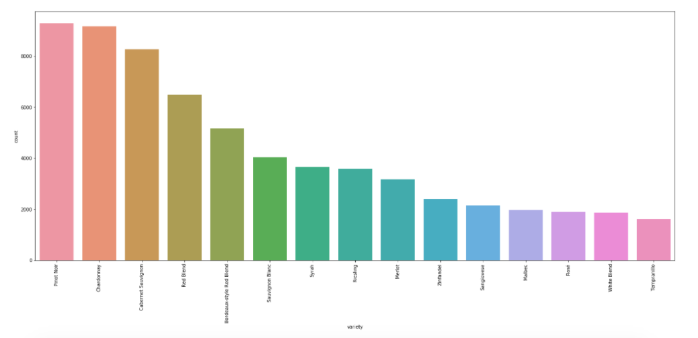
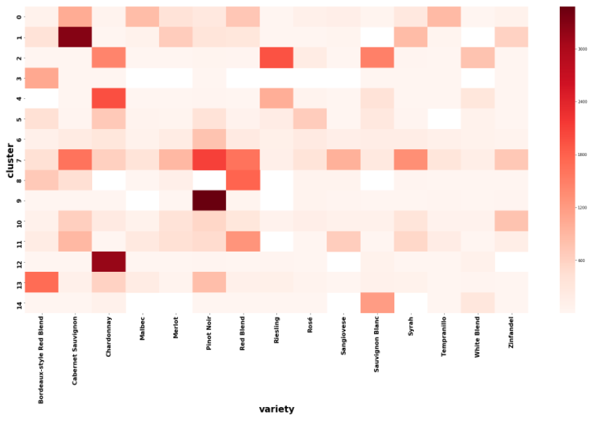

# Exploring Wine Descriptions w/NLP and kMeans

## Introduction

This analysis was done using the Kaggle [wine reviews](https://www.kaggle.com/zynicide/wine-reviews) dataset. If you would like to look at the analysis on my profile there, please check it out [here](https://www.kaggle.com/kitakoj18/exploring-wine-descriptions-with-nlp-and-kmeans) and feel free to comment or upvote there :)

This dataset is rich with wine description information so I was curious to see what common things were said in them. The purpose of this analysis is to find clusters or groups that represent 'average' descriptions. That is, I want to discover which words tend to appear together. From there, I am curious to see if there are certain wine variety descriptions more prevalent than others in each of the clusters. That way we can gain some insight on how some wine types are generally reported. I will do all of this by utilizing powerful Natural Language Processing algorithms and the kMeans unsupervised machine learning algorithm.

## Exploratory Data Analysis

The first check is to see where values are missing; the information in this file is for the most part complete. Luckily there isn't any data missing in the description and variety columns, which are the main columns I need for this analysis. There are 5 missing values for country that I originally filled in by looking at which winery was listed with these missing values, then looked up other entries with that same winery to determine country. I wanted to do this because I was thinking of exploring what words are used to describe wines from various countries but scratched this idea and decided to focus only on the different varieties.

There are some duplicates with the descriptions. Although the duplicates won't affect the averaging used to find the kMeans centroids, I still decided to remove them because I only need unique descriptions to perform the clustering.

There are a TON of wine types in this dataset. However, with kMeans, I want to limit the number of wine varieties to the number of clusters because I'm hoping the algorithm will be able to find individual clusters or average descriptions for each type of wine. If I limit wine varieties to those where there are more than 1500 entries in the dataset, 15 types are narrowed down. Fifteen clusters sounds reasonable to start off with, so I will create a new dataframe and use descriptions only from these 15 kinds of wines. The 15 wine types are Cabernet Sauvignon, Sauvignon Blanc, Pinot Noir, Chardonnay, Tempranillo, Malbec, Rosé, Syrah, Sangiovese, Red Blend, Riesling, White Blend, Zinfandel, Bordeaux-style Red Blend, and Merlot.

## Natural Language Processing

In Natural Language Processing, there is a term called stop words. These are tokens (NLP's definition for characters or groups of characters including words, punctuation, etc.) that are used frequently in the texts of the group of documents, or corpus, but don't really give much meaning or context to what they're being used in; they're generally used more for grammatical purposes. Examples of stop words are 'the', 'is', 'are', etc. There might be additional words that do not give much meaning to the text depending on what the situation is. I will discuss more stop words I could have used for this analysis in the conclusion but for now, I will use the English stop words list that is defaulted in the sklearn library in addition to some punctuation. When our text is being vectorized, the tokens included in the stop words list will not be included in the vectorization. Having stop words also helps us keep down the feature space.

To vectorize the tokens of each description, sklearn has a count vectorizer or tf-idf (term frequency-inverse document frequency) vectorizer object that will do all of this for us. The count vectorizer simply creates a vector of counts of each word in each description. The tf-idf vectorizer, on the otherhand, takes it further by creating frequency vectors that account for how important each token is relative to the document it is in AND relative to the corpus. A word might appear more than others in the same document, making it important to that piece of text. However, if that highly frequented word is in many of the other documents in the corpus, then that word does not really help distinguish that single document from the others. For this analysis, I have used the tf-idf vectorizer.

Using the get_feature_names() method with the tf-idf vectorizer, I can explore and get a sense of feeling what words were vectorized in the process. Looking at a subset, I noticed that different forms of similar words show up such as 'abrasive', 'abrasiveness', and 'absorb', 'absorbed', 'absorbs'. In many cases these various forms of the same word are redundant and unnecessarily extend our feature space.

Since the tf-idf vectorizer doesn't account for any stemming/lemmatizing, I need to override the default tokenizer parameter. I created my own function utilizing the Natural Language Toolkit (NLTK) library to reduce words to their root forms. Various stemmers and lemmatizers reduce words to root forms differently because there might be cases where some forms do indeed produce different meanings or we want them to mean different things. For now I decided to use NLTK's SnowballStemmer.

In addition, I have decided that I do not want any numbers included in the analysis. Therefore, I have added NLTK's RegexpTokenizer to my function above to use a regular expression that reduces my tokens list to words only.The last thing I did for text preprocessing is adjust the max_features parameter in the tf-idf vectorizer to vectorize only the top max_features in the corpus.  

## kMeans Clustering

Now that the text preprocessing is done, I can finally apply the kMeans algorithm to cluster our description vectors. kMeans needs to initialize k centroids in order for it to start finding the k clusters. There are a few approaches to how the centroids are initialized but it typically involves some sort of randomization. Because of this randomness, the algorithm is not deterministic meaning that it might come up with different clusters if we run it multiple times. Therefore, it is wise to run the algorithm multiple times and have it choose the version that has the lowest within cluster variance. Luckily sklearn does this for us already with the n_init parameter. The default is 10 different centroid initializations before it returns the best version but I lowered it to 5 to quicken the runtime.

The model has a cluster centers attribute that returns the coordinates of each of the k cluster centroids. Each token in the vectorizer we created earlier has a dimension or coordinate in the centroid and represents its relative frequency within that cluster. So to find the words with the highest frequency in a cluster, we have to locate the indices of the highest values of the centroid, which then correspond to the indices of the tokens in the vectorizer.

Below are the 15 clusters kMeans found and the top 10 words used in each. We can see how wines are generally described for each cluster. Cluster 6, for example, seems to describe a wine that's more citrusy and acidic.

0 : berri, aroma, finish, plum, palat, flavor, feel, herbal, red, nose  
1 : blackberri, currant, dri, tannin, flavor, cherri, rich, oak, drink, wine  
2 : citrus, peach, finish, white, lemon, flavor, lime, palat, acid, wine  
3 : sampl, barrel, wine, tannin, fruit, ripe, wood, structur, juici, veri  
4 : appl, green, flavor, pear, finish, palat, citrus, wine, acid, aroma  
5 : wine, acid, fruiti, fresh, fruit, attract, drink, ripe, soft, red  
6 : light, fruit, wine, flavor, fresh, red, finish, cherri, acid, aroma  
7 : wine, fruit, cherri, flavor, finish, tannin, red, spice, berri, note  
8 : cabernet, sauvignon, blend, merlot, franc, petit, verdot, wine, syrah, cherri  
9 : pinot, noir, cherri, cola, silki, flavor, raspberri, dri, acid, drink  
10 : sweet, cherri, flavor, soft, simpl, tast, raspberri, like, candi, wine  
11 : black, cherri, palat, aroma, tannin, fruit, plum, pepper, dark, spice  
12 : chardonnay, pineappl, butter, oak, toast, flavor, vanilla, acid, rich, pear  
13 : wine, age, fruit, wood, structur, tannin, year, rich, firm, ripe  
14 : blanc, sauvignon, flavor, citrus, crisp, acid, green, lime, grapefruit, wine  

Now I want to take a deeper look at each cluster. I want to see if there is one wine variation more prevalant than others in each of the clusters the kMeans algorithm found.

Below I created a heatmap that maps out each of the 15 wine variations and their counts in each of the 15 clusters. It appears that Cabernet Sauvignon is very present in cluster 13, Chardonay in cluster 12, Pinot Noir in cluster 0, and Riesling in cluster 1. Zinfandel might be highly described by cluster 8 since there are a lot of entries for this type in this cluster relative to the total number of entries in the dataset. With this step, we can easily look at the words that are associated with these kinds of wines.

## Conclusion

Although kMeans didn't find a one-to-one relationship between each of the 15 wine types and clusters, we were still able to come up with clusters that greatly represented certain wines like Cabernet, Chardonay, Pinot Noir, and Riesling. This allows us to see how these wine types are generally described, which is pretty cool! It might not have been the most useful in this case, but this type of analysis can definitely be done on other data involving reviews, etc. If we worked for a restaurant, we could determine what are some common things said in the reviews to help us know what we're doing right and what we're doing wrong so we can take action.

I didn't add any stop words for this analysis but after looking at the top 10 words in each cluster, I can think of at least a couple I could have included. For instance, the word 'flavor' appears in almost all of the clusters. I would say that this word doesn't give any useful information regarding the description so if I re-ran everything again, I would definitely add this to the stop words list. You also probably noticed that some of the descriptions actually had the wine name in them. I decided to keep these in because I was thinking that it would be easier to identify which words appeared more with certain wine varieties written in the description. The wine types can also be considered to be included in the stop words list.

Another thing to play with is the hyperparameter k i.e. the number of clusters we want the algorithm to group. For this case, I had an idea that 15 groups would be ideal since I had 15 different kinds of wine. There are many situations, however, where you don't really have an idea of how many you should pick. 8 is the default with sklearn but another way to determine k is through the use of an elbow plot, which involves looking at the within cluster variance for various values of k.

I would like to consider using PCA on this dataset to account for correlations in the token vectors and to help visualize the clusters. I would also like to learn more about the t-SNE unsupervised clustering algorithm so I might consider using this dataset to help me with that learning.

LASTLY, it'd be interesting to see how well the multinomial Bayes classification algorithm would perform to predict wine varieties, country location, etc., based off the descriptions.
